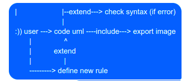

# Code to UML Diagram

## Why ?

## How ?

### Data structure:

#### abstract class FileContent

(Define how content read from file is stored)

- concrete class TextFileContent
  - content: String - represent the data in file
- concrete class CSVFileContent:
  - content: Dict<columnName, row>
- concrete class JSONFileContent
  - content: List[Token]
- concrete class XMLFileContent

#### [class Position](https://codemaster138.github.io/blog/creating-an-interpreter-part-1-lexer/)

(Keep track of positioning information of our code process.)

#### abstract class Token

(Contain information about each token of our language)

- concrete class ArrowToken:
  - type: ARROW_TYPE
  - value: The text in the middle of the arrow
- concrete class ActorToken
  - type: ACTOR_TYPE
  - value: The actor's name
- concrete class UsecaseToken
  - type: USECASE_TYPE
  - value: The usecase's name
- concrete class ClassToken
  - type: CLASS_TYPE
  - value: instance of some ClassObject class

#### class UMLGraph

Contain information about our uml diagram relationships containing:

- type: USE_CASE_DIAGRAM/CLASS_DIAGRAM/....
- nodes: Dict<nodeId, Node>
- edges: Dict<edgeId, Edge>
- graphRepresentation: List<srcNodeId, targetNodeId, edgeId>
- abstract Node:

  - id: ID
  - type: ACTOR_TYPE/USECASE_TYPE/CLASS_TYPE
  - value: ref to a token
- abstract Edge:

  - id: ID
  - abstract Arrow:
    - SolidArrow
    - DottedArrow
    - SequeceArrow:
      - priority: Int
    - ...

#### interface Converter

- Define a template to convert a file content to uml diagram (Template design pattern):
  - Read file and get its content.
  - Create a lexer parse the content into list of tokens.
  - Create parser convert these tokens into a graph.
  - Convert the graph to uml diagram.

--> Others can freely create their own Converter

### IO:

    class Reader (define how content is read with different file formats)
        - Read file module applied Flexible object (format - stategy to read).
        - Input: File name (string)
        - Output: instance of FileContent
        - Use Strategy design pattern to read the file (based on its extension).
    --> Others can freely create a Reader for new file format

### Parse code:

    Create class Lexer parse codes to tokens:
        - Input: Code content (FileContent)
        - Output: List of tokens: [ArrowToken, ActorToken, UsecaseToken, ....]
        - For applying Visitor pattern, we use FileContent concrete classes as visitors
        - Has different overload parse methods for every FileContent concrete class

    Create class Parser parse list of tokens into a graph represent our diagrams:
        - Input: List of tokens
        - Output: An instance of UMLGraph

### Export to UML diagram

Add to_uml method to UMLGraph to export a graph in [DOT language with graphviz](https://pypi.org/project/graphviz/?fbclid=IwAR3bsmvtZV3OnTI6pB7ix31h5I4MrgY5z8eFH1KN29g7EFmWOIpzlsHCTpA).

## Contributor
